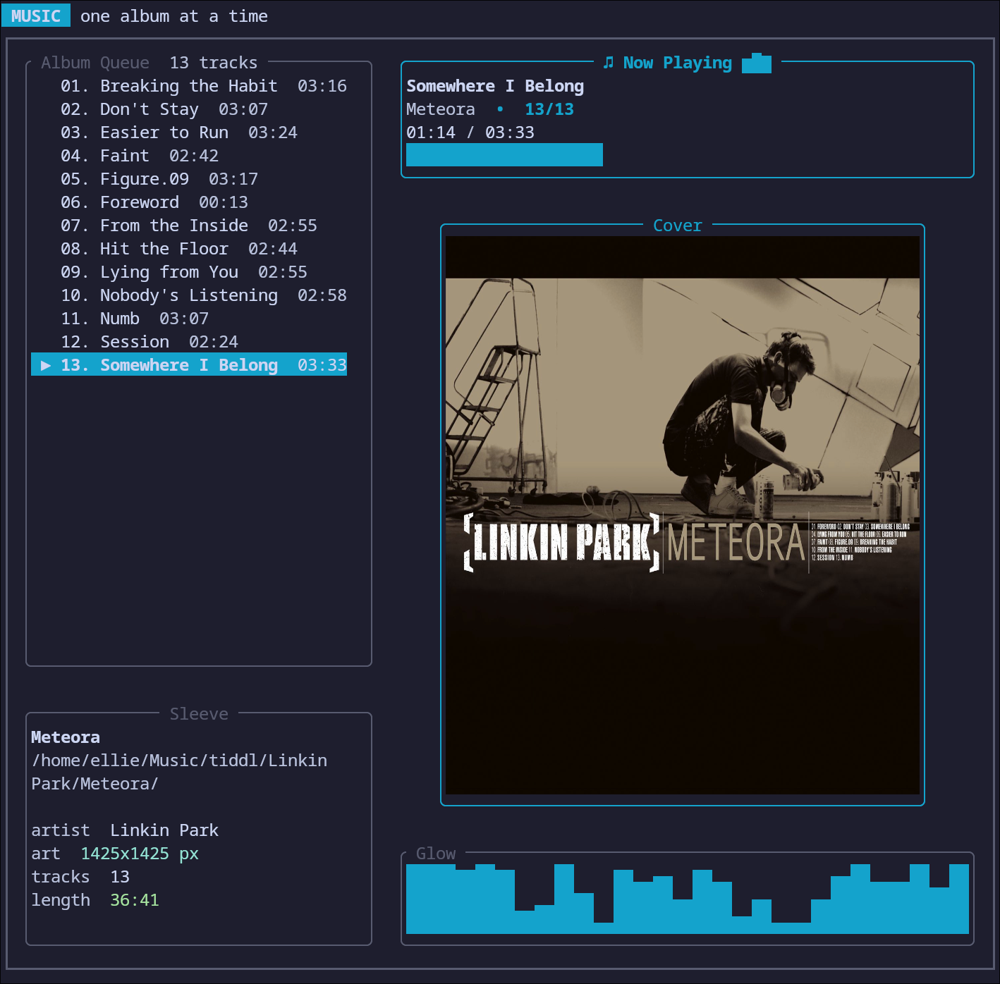

# music



`music` is a minimal Rust TUI music player built with `ratatui`, `tokio`, and `rodio`.
It is intentionally focused on one album directory at a time, with a clean transport UI,
mouse support, and high-resolution album art rendering through the Kitty graphics protocol.

## Features

- Single-album playback from a local directory
- Mouse-clickable transport controls
- Keyboard transport and seeking controls
- Track queue, progress bar, and animated visualizer
- Kitty graphics protocol support for album covers in compatible terminals
- Terminal-theme-friendly UI with configurable accent colors

## Requirements

- Rust stable
- A supported audio output device
- A Kitty-graphics-compatible terminal if you want full-resolution album art

In compatible terminals such as Kitty, WezTerm, and Ghostty, `music` uses graphics protocol
rendering for sharp album art. Otherwise it falls back to a text-mode cover renderer.

## Usage

```bash
cargo run -- /path/to/album
```

If no path is provided, `music` uses the current working directory.

Supported audio formats:

- `mp3`
- `flac`
- `wav`
- `ogg`
- `m4a`

Recognized cover filenames:

- `cover.*`
- `folder.*`
- `front.*`
- `album.*`

## Controls

- `Space`: play / pause
- `n` or `Right`: next track
- `p` or `Left`: previous track
- `s`: stop
- `r`: toggle repeat
- `]`: seek forward 5 seconds
- `[`: seek backward 5 seconds
- `q` or `Esc`: quit

Mouse support:

- Click transport buttons
- Click the progress bar to seek

## Theme Configuration

By default, the UI follows the terminal theme where possible.
You can override colors with environment variables:

- `MUSIC_ACCENT`
- `MUSIC_ACCENT_ALT`
- `MUSIC_SUCCESS`
- `MUSIC_BORDER`
- `MUSIC_TEXT`
- `MUSIC_MUTED`
- `MUSIC_SURFACE`
- `MUSIC_ELEVATED`

Values can be named colors like `cyan` or hex colors like `#5fd7ff`.

Example:

```bash
MUSIC_ACCENT=#ff875f MUSIC_ACCENT_ALT=#5f87ff cargo run -- ~/Music/Album
```

Graphics protocol behavior can also be overridden:

- `MUSIC_FORCE_GRAPHICS=1` forces protocol image rendering
- `MUSIC_DISABLE_GRAPHICS=1` disables protocol image rendering

## License

MIT
